# Laporan Modul 1: Review Dasar Pemrograman Java
**Mata Kuliah:** Praktikum Design Pattern
**Nama:** [Safirina]  
**NIM:** [2024573010042]  
**Kelas:** [TI 2A]

---

## Abstrak
Laporan ini membahas pengenalan dasar tentang pemrograman berorientasi objek (OOP) dan alasan penggunaan bahasa Java. Dijelaskan juga kelebihan Java, komponen penting yang diperlukan seperti JDK, JRE, dan IDE, serta gambaran umum tentang persiapan praktikum. Selain itu, laporan menyinggung troubleshooting umum yang mungkin terjadi dan pedoman penulisan laporan praktikum.

1. Mendokumentasikan hasil pembelajaran awal tentang OOP dan Java.
2. Menunjukkan pemahaman teori serta ekosistem Java.
3. Membuktikan kesiapan menggunakan tools yang diperlukan.
4. Menjadi bukti keberhasilan menjalankan program sederhana.
5. Melatih penyusunan laporan dengan format ilmiah dan terstruktur.

---

## 1. Pendahuluan
- Java dipilih sebagai bahasa pemrograman karena memiliki banyak keunggulan. Salah satunya adalah platform independence dengan konsep “write once, run anywhere” yang memungkinkan program dijalankan di berbagai sistem operasi tanpa perubahan kode. Selain itu, Java merupakan strongly typed language dengan sistem pemeriksaan tipe yang ketat sehingga meminimalkan error saat runtime. Java juga dilengkapi rich library yang menyediakan berbagai pustaka siap pakai, mulai dari manipulasi string, networking, hingga koneksi database. Dukungan dari komunitas besar memudahkan pembelajaran dan pemecahan masalah, sementara statusnya sebagai industry standard menjadikan penguasaan Java sangat penting dalam dunia kerja.

Untuk mendukung pengembangan, diperlukan beberapa tools utama dalam ekosistem Java, yaitu:

JDK (Java Development Kit) → paket lengkap berisi compiler, library, dokumentasi, dan debugging utilities untuk menulis serta mengompilasi kode Java.

JRE (Java Runtime Environment) → lingkungan runtime berisi JVM dan core libraries, digunakan untuk menjalankan aplikasi Java yang sudah dikompilasi.

JVM (Java Virtual Machine) → inti dari platform Java yang mengeksekusi bytecode, mengelola memori dengan garbage collector, serta melakukan optimisasi performa melalui JIT compiler.

IDE (Integrated Development Environment) → software seperti IntelliJ IDEA yang menyediakan editor, debugger, manajemen proyek, dan fitur otomatisasi untuk mempermudah pengembangan aplikasi Java.

---

## 2. Pengenalan Java dan Lingkungan Pengembangan
- Java adalah bahasa pemrograman berorientasi objek yang populer dan banyak digunakan untuk pengembangan aplikasi desktop, web, dan mobile. Java menggunakan sintaks yang mirip dengan C++ tetapi dirancang untuk lebih mudah dipahami dan digunakan.

Untuk memulai pemrograman Java, Anda perlu:

1.JDK (Java Development Kit): Berisi compiler dan tools untuk mengembangkan program Java.
2.IDE (Integrated Development Environment): Seperti IntelliJ IDEA, Eclipse, atau NetBeans untuk menulis dan menjalankan kode.

## Langkah praktikum 1

1.Pastikan JDK dan Intellij IDE Community Edition sudah terinstal. Jika belum, kunjungi url berikut untuk mengunduh JDK Amazon Correto dan Intellij
2.Pastikan Anda memilih versi yang sesuai dengan arsitektur sistem operasi:
3.buat repository pada github dengan nama:
    nama:ti_design pattern
    location: disesuaikan
    build:intelij
    JDK: amazon correto
    hilangkan centang pada bagian add sample code
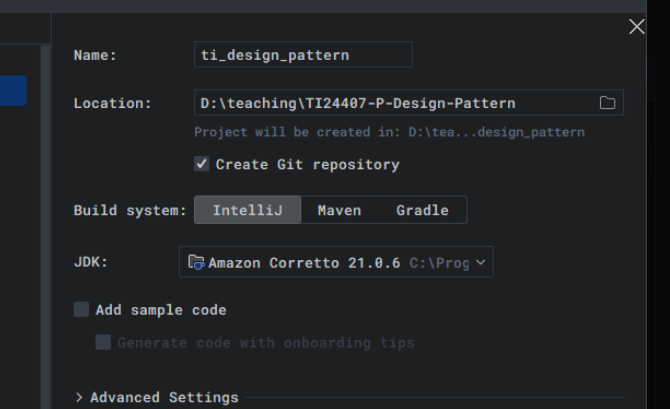
4.Buat sebuah package baru didalam folder src, beri nama modul_1.
5.buat sebuah class didalam package modul_1, beri nama HelloWorld.
isi dengan kode dibawah ini:
````
package praktikum_1;

public class HelloWorld {
    public static void main(String[] args) {
        System.out.println("Hello, World!");
    }
}
````
6.jalankan program, tekan tombol run untuk menjalankan program.
output:
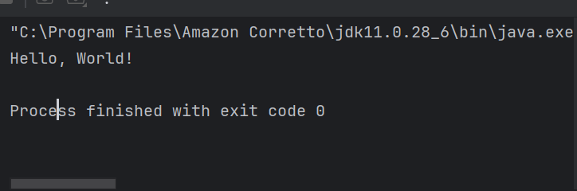

## 3. Variable dan Tipe Data
Variabel digunakan untuk menyimpan data dalam program. Setiap variabel memiliki tipe data yang menentukan jenis nilai yang dapat disimpan. Tipe data dasar di Java:

1.int: Bilangan bulat (contoh: 10, -5)
2.double: Bilangan desimal (contoh: 3.14, -0.5)
3.boolean: Nilai true atau false
4.char: Karakter tunggal (contoh: 'A', '1')
5.String: Teks (contoh: "Hello")
## Langkah Praktikum 2
1.buat sebuah class baru dalam modul_1, beri nama variable
2.tuliskan kode berikut:
````
package praktikum_1;

public class variable {
    public static void main(String[] args) {
    int umur = 20;
    double tinggi = 1.75;
    boolean isMahasiswa = true;
    char jenisKelamin = 'L';
    String nama = "Budi";

    System.out.println("Nama: " + nama);
    System.out.println("Umur: " + umur);
    System.out.println("Tinggi: " + tinggi);
    System.out.println("Mahasiswa: " + isMahasiswa);
    System.out.println("Jenis Kelamin: " + jenisKelamin);
}
}
````
output:
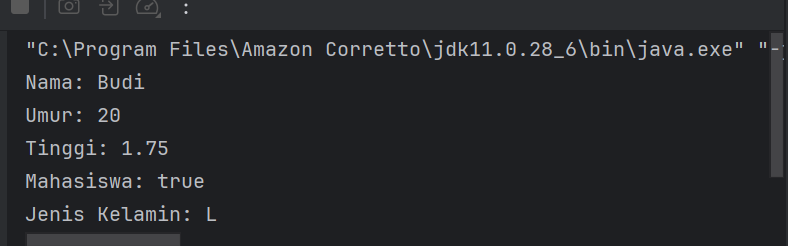

3.kerjakan latihan ini
Buatlah program untuk menampilkan data diri anda yang lengkap dengan attribut seperti berikut:
Nama Lengkap, Tempat Lahir, Tanggal Lahir, Golongan Darah, Umur,
Tinggi Badan, Jenis Kelamin, Agama, Pekerjaan, gunakan tipe data yang tetap untuk setiap variable.
4.buat sebuah package bernama latihan di dalam modul_1, kemudian buat sebuah class beri nama data diri.
````
package praktikum_1.latihan;

public class datadiri {
    public static void main(String[] args) {
        String namaLengkap = "Safrina";
        String tempatLahir = "Tambon Tunong";
        String tanggalLahir = "29 Juli 2005";
        String golonganDarah = "A";
        int umur = 20; // sesuaikan jika perlu
        double tinggiBadan = 160; // ganti sesuai tinggi kamu (cm)
        char jenisKelamin = 'P'; // P = Perempuan, L = Laki-laki
        String agama = "Islam"; // ganti jika berbeda
        String pekerjaan = "Mahasiswa"; // ganti jika perlu

        System.out.println("Nama Lengkap: " + namaLengkap);
        System.out.println("Tempat Lahir: " + tempatLahir);
        System.out.println("Tanggal Lahir: " + tanggalLahir);
        System.out.println("Golongan Darah: " + golonganDarah);
        System.out.println("Umur: " + umur);
        System.out.println("Tinggi Badan: " + tinggiBadan + " cm");
        System.out.println("Jenis Kelamin: " + jenisKelamin);
        System.out.println("Agama: " + agama);
        System.out.println("Pekerjaan: " + pekerjaan);
    }
}
````
output:
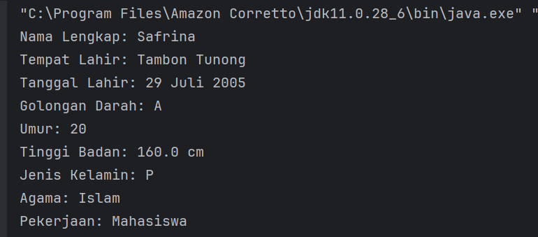

## 4.Operator dan Expressi
Operator digunakan untuk melakukan operasi pada variabel dan nilai. Jenis operator:

1.Aritmatika: +, -, *, /, % 
2.Perbandingan: ==, !=, >, <, >=, <=
3.Logika: && (AND), || (OR), ! (NOT)

## Langkah praktikum 3
1.buatlah sebuah class baru dalam packagemodul_1 beri nama operator
tuliskan kode berikut:
````
package praktikum_1;

public class operator {
    public static void main(String[] args) {
    int a = 10;
    int b = 5;

    System.out.println("a + b = " + (a + b));
    System.out.println("a > b? " + (a > b));
    System.out.println("a == b? " + (a == b));
}
}
````
output:
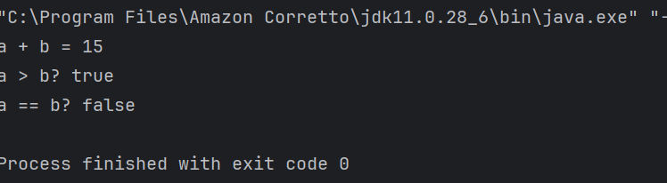
3.kerjakan latihan berikut ini:
4.buat sebuah class beri nama luaspersegipanjang.
Buat program untuk menghitung luas persegi panjang (panjang * lebar)
````
package praktikum_1.latihan;

public class LuasPersegiPanjang {
    public static void main(String[] args) {
    int panjang = 10;  // ganti sesuai kebutuhan
    int lebar = 5;     // ganti sesuai kebutuhan

    int luas = panjang * lebar;

    System.out.println("Panjang: " + panjang);
    System.out.println("Lebar: " + lebar);
    System.out.println("Luas Persegi Panjang: " + luas);
}
}
````
output:
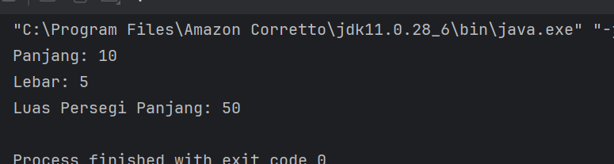

## 5.Percabangan (if-else dan switch-case)
Percabangan digunakan untuk mengambil keputusan berdasarkan kondisi.
If-Else:
````
if (kondisi) {
    // Blok kode jika kondisi true
} else {
    // Blok kode jika kondisi false
}
````
switch-case
````
switch (variabel) {
    case nilai1:
        // Blok kode jika variabel == nilai1
        break;
    case nilai2:
        // Blok kode jika variabel == nilai2
        break;
    default:
        // Blok kode jika tidak ada case yang sesuai
}
````
## langkah praktikum 4
1.Buat sebuah class baru di dalam package modul_1 dan beri nama Percabangan
2.Tuliskan kode berikut:
````
package praktikum_1;

public class percabangan {
    public static void main(String[] args) {
    int nilai = 85;

    if (nilai >= 75) {
        System.out.println("Anda lulus!");
    } else {
        System.out.println("Anda tidak lulus.");
    }
}
}
````
output:
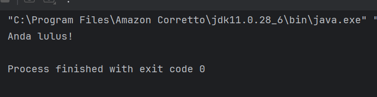
3.kerjakan latihan ini:
Buat program untuk menentukan apakah suatu bilangan genap atau ganjil.
4.buat class didalam package latihan beri nama genapganjil
````
package praktikum_1.latihan;

public class GenapGanjil {
    public static void main(String[] args) {
        int angka = 7; // ganti dengan angka yang ingin dicek

        if (angka % 2 == 0) {
            System.out.println(angka + " adalah bilangan genap.");
        } else {
            System.out.println(angka + " adalah bilangan ganjil.");
        }
    }
}
````
output:
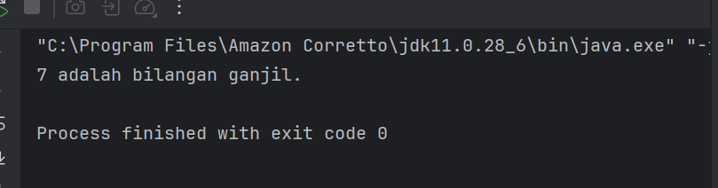

## 6.Perulangan(for, while, do-while)
Perulangan digunakan untuk mengulang blok kode.
For:
````
for (inisialisasi; kondisi; update) {
    // Blok kode yang diulang
}
````
while:
````
for (inisialisasi; kondisi; update) {
    // Blok kode yang diulang
}
````
do-while
````
do {
    // Blok kode yang diulang
} while (kondisi);
````
## langkah praktikum 5
1.Buat sebuah class baru di dalam package modul_1 dan beri nama Perulangan
2.Tuliskan kode berikut:
````
package praktikum_1;

public class perulangan {
    public static void main(String[] args) {
        for (int i = 1; i <= 5; i++) {
            System.out.println("Iterasi ke-" + i);
        }
    }
}
````
output:
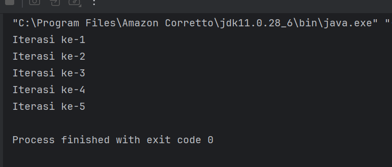
3.kerjakan latihan berikut ini:
Buat program untuk mencetak bilangan ganjil dari 1 hingga 20. Buat 3 program dengan menggunakan for, while, do-while.
4.buat tiga class dalam package latihan beri nama for, while, do while.
for:
````
package praktikum_1.latihan;

public class ganjilfor {
    public static void main(String[] args) {
        for (int i = 1; i <= 20; i++) {
            if (i % 2 != 0) {
                System.out.print(i + " ");
            }
        }
    }
}
````
output:
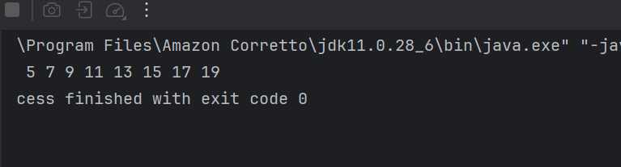
while:
````
package praktikum_1.latihan;

public class ganjilwhile {
    public static void main(String[] args) {
    int i = 1;
    while (i <= 20) {
        if (i % 2 != 0) {
            System.out.print(i + " ");
        }
        i++;
    }
}
}
````
output:
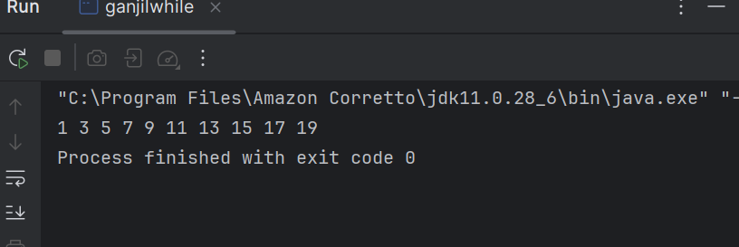
do-while:
````
package praktikum_1.latihan;

public class ganjildowhile {
    public static void main(String[] args) {
        int i = 1;
        do {
            if (i % 2 != 0) {
                System.out.print(i + " ");
            }
            i++;
        } while (i <= 20);
    }
}
````
output:
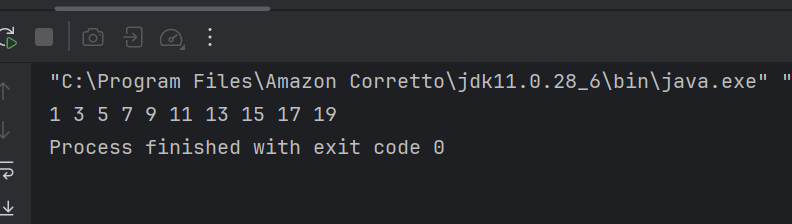

## 7.Practicw Problem dan Solusinya
Practice Problem:
1Buat program untuk menghitung faktorial dari suatu bilangan.
2.Buat program untuk mengecek apakah suatu bilangan adalah bilangan prima.
3.Buat program untuk mencetak pola segitiga menggunakan *.

Solusi:
1.Buat sebuah class baru di dalam package modul_1 dan beri nama Factorial dan isikan kode berikut. Kemudian jalankan untuk melihat hasilnya.
````
package praktikum_1;

public class faktorial {
    public static void main(String[] args) {
    int n = 5;
    int hasil = 1;

    for (int i = 1; i <= n; i++) {
        hasil *= i;
    }

    System.out.println("Faktorial dari " + n + " adalah " + hasil);
}
}
````
output:
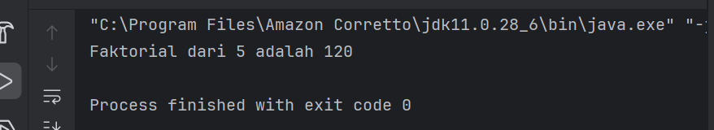
2.Buat sebuah class baru di dalam package modul_1 dan beri nama Prima dan isikan kode berikut. Kemudian jalankan untuk melihat hasilnya
````
package praktikum_1;

public class prima {
    public static void main(String[] args) {
        int n = 7;
        boolean isPrima = true;

        for (int i = 2; i <= n / 2; i++) {
            if (n % i == 0) {
                isPrima = false;
                break;
            }
        }

        System.out.println(n + (isPrima ? " adalah bilangan prima." : " bukan bilangan prima."));
    }
}
````
output:
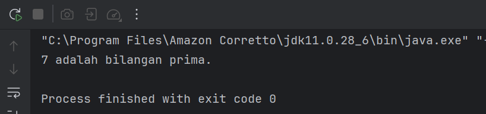
3.Buat sebuah class baru di dalam package modul_1 dan beri nama Segitiga dan isikan kode berikut. Kemudian jalankan untuk melihat hasilnya.
````

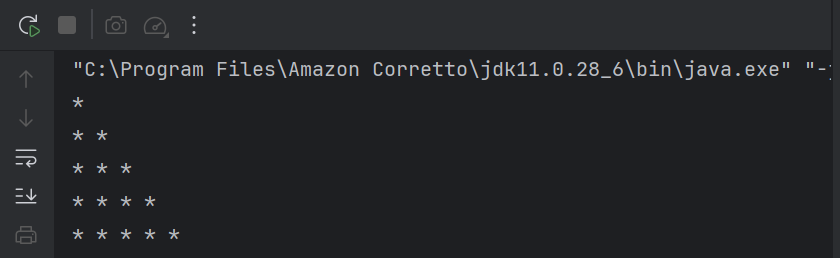
1. Buka **File Explorer** dan navigasikan ke folder **Downloads**.
2. Double-click file installer Amazon Corretto (contoh: `amazon-corretto-17-x64-windows-jdk.msi`).
3. Jika muncul dialog **User Account Control**, klik **Yes** untuk memberikan permission.
4. Pada welcome screen installer, klik **Next**.
5. Baca dan setujui **License Agreement** dengan mencentang *"I accept the terms in the License Agreement"*, kemudian klik **Next**.
6. Pada halaman **Custom Setup**, biarkan semua komponen tercentang (default installation), klik **Next**.
7. Catat dengan teliti **installation path** yang ditampilkan (biasanya: `C:\Program Files\Amazon Corretto\jdk17.x.x_xx\`).
8. Klik **Install** untuk memulai proses instalasi.
9. Tunggu proses instalasi selesai (biasanya 2–5 menit).
10. Klik **Finish** untuk menyelesaikan instalasi.

- Praktikum 2: Instalasi Intellj Idea CE

Langkah 1: Mengakses Website JetBrains

1. Buka browser web dan navigasikan ke: https://www.jetbrains.com/idea/
2. Pada halaman utama, Anda akan melihat dua pilihan: **Ultimate** (berbayar) dan **Community** (gratis).
3. Klik tombol **"Download"** di bawah *Community Edition*.
4. Anda akan diarahkan ke halaman download yang otomatis mendeteksi sistem operasi Anda.

Langkah 2: Download IntelliJ IDEA

1. Pastikan tab **"Community"** dipilih (bukan *Ultimate*).
2. Sistem akan otomatis mendeteksi OS Anda dan menampilkan **download button** yang sesuai.
3. Klik **"Download"** untuk memulai download.
4. Ukuran file sekitar **700MB–1GB**, pastikan koneksi internet stabil.
5. File installer akan tersimpan di folder **Downloads** dengan nama seperti:
    - Windows → `ideaIC-2023.x.x.exe`
    - macOS → `ideaIC-2023.x.x.dmg`
    - Linux → `ideaIC-2023.x.x.tar.gz`


Langkah 3: Instalasi di Windows

1. Navigasikan ke folder **Downloads** dan double-click file `ideaIC-2023.x.x.exe`.
2. Jika Windows menampilkan **security warning**, klik **"Yes"** atau **"Run anyway"**.
3. Pada welcome screen, klik **Next**.
4. Pilih **installation directory** (default: `C:\Program Files\JetBrains\IntelliJ IDEA Community Edition 2023.x.x`).
5. Klik **Next** untuk melanjutkan.
6. Pada **Installation Options**, centang opsi berikut:
    - *"64-bit launcher"* (untuk sistem 64-bit)
    - *"Add launchers dir to the PATH"*
    - *"Add 'Open Folder as Project'"*
    - *.java – Associate .java files*
    - *"Download and install JetBrains Runtime"*
7. Klik **Next**.
8. Pada **Start Menu Folder**, biarkan default dan klik **Install**.
9. Tunggu proses instalasi selesai (**5–10 menit**).
10. Centang **"Run IntelliJ IDEA Community Edition"** dan klik **Finish**.

Langkah 4: First Time Setup IntelliJ IDEA

1. Saat pertama kali membuka **IntelliJ IDEA**, Anda akan melihat *"Welcome to IntelliJ IDEA"*.
2. Pada dialog *"Import IntelliJ IDEA Settings"*, pilih **"Do not import settings"**.
3. Klik **OK**.
4. Pilih **UI Theme**:
    - Light → Tema terang (cocok untuk lingkungan terang).
    - Darcula → Tema gelap (cocok untuk mata yang sensitif).
5. Klik **Next**.
6. Pada *"Default plugins"*, biarkan semua plugin default tercentang.
7. Klik **Next**.
8. Pada *"Featured plugins"*, Anda bisa skip dulu dengan klik **"Start using IntelliJ IDEA"**.


Langkah 5: Verifikasi Konfigurasi JDK di IntelliJ IDEA

1. Pada **Welcome screen IntelliJ IDEA**, klik **"New Project"**.
2. Di panel kiri, pilih **"Java"**.
3. Pastikan **Project SDK** menampilkan Amazon Corretto yang telah diinstal.
4. Jika belum muncul, klik **Add SDK → JDK**.
5. Navigate ke folder instalasi Amazon Corretto:
    - Windows → `C:\Program Files\Amazon Corretto\jdk17.0.x_xx`
    - macOS → `/Library/Java/JavaVirtualMachines/amazon-corretto-17.jdk/Contents/Home`
    - Linux → `/usr/lib/jvm/java-17-amazon-corretto`
6. Klik **OK** untuk menambahkan JDK.
7. Klik **Cancel** untuk keluar dari dialog *New Project*.


---

## 3. Laporan proses pembuatan program hello world dengan java
- Praktikum 3: Persiapan Repository Projek

1. Masuk ke akun github yang telah dibuat: https://github.com/topics/login
2. Buatkan sebuah repository baru dengan nama praktikum_PBO-2024573010066

- Praktikum 4: Hello World Java

1. Buat sebuah project baru di intellj dengan memilih file -> new -> project
2. Buatkan file dan folder pada new project, untuk uji coba program dan buat laporan, seperti berikut:
   
3. Buat sebuah java class baru dan beri nama Main dengan klik kanan pada folder src pilih new -> Java Class
4. Tuliskan kode seperti berikut:

````
   public class Main {
       public static void main(String[] args) {
           System.out.println("Hello World");
       }
   }
````
`5.`Jalankan program dan berikut hasilnya:

`6.` Kemudian push program tersebut ke github

---

## 4. Referensi
Module 1 - Course Introduction & Lab Setup-https://hackmd.io/@mohdrzu/ByrYifVFeg
w3school-https://www.w3schools.com/java/java_oop.asp


---